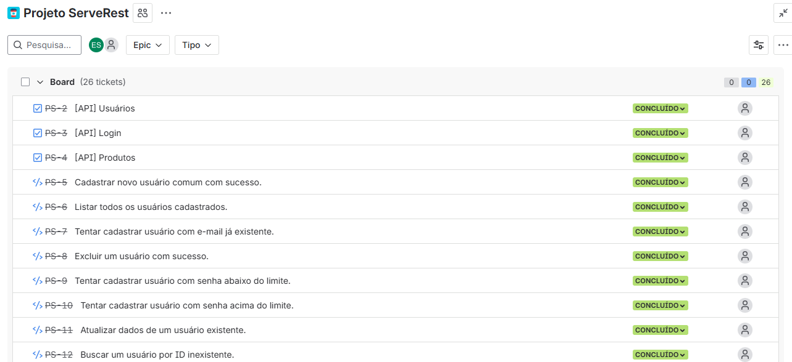

Projeto de Automação de Testes para a API ServerRest
Este projeto contém um conjunto de testes automatizados para a API ServerRest, que simula o backend de um e-commerce. O objetivo é garantir a qualidade, a estabilidade e a conformidade da API com as regras de negócio definidas.

📑 Sobre o Projeto
A estratégia de testes foi concebida a partir de um Plano de Testes detalhado, que cobre a análise da aplicação, a definição de cenários críticos, a gestão de riscos e a abordagem de automação.

A gestão dos casos de teste, a execução e o reporte de defeitos são centralizados no Jira, com o auxílio do plugin QAlity Test Management.

Endpoints Cobertos
Os testes automatizados cobrem os seguintes endpoints da API:

/login: Autenticação de utilizadores.

/usuarios: Gestão de utilizadores (CRUD).

/produtos: Gestão de produtos (CRUD).

/carrinhos: Gestão de carrinhos de compras.

🛠️ Tecnologias Utilizadas
Framework de Automação: Robot Framework

Linguagem: Python

Bibliotecas Robot Framework:

RequestsLibrary: Para realizar chamadas HTTP à API.

Collections: Para manipulação de dicionários (JSON).

String: Para gerar dados aleatórios.

Gestão de Testes: Jira com o plugin QAlity

Gestão de Dependências: pip com o ficheiro requirements.txt.

📂 Estrutura do Projeto
O projeto está organizado da seguinte forma para garantir a manutenibilidade e a reutilização de código:

/ProjetoServerRest
├─── resources/             # Keywords reutilizáveis e variáveis globais
│    ├─── api_keywords.robot # Keywords de alto nível (ex: Login, Cadastrar Produto)
│    └─── variables.py       # Variáveis de ambiente e funções para gerar dados dinâmicos
├─── tests/                 # Suítes de teste, separadas por endpoint
│    ├─── login.robot
│    ├─── produtos.robot
│    └─── usuarios.robot
├─── results/                # Pasta onde os relatórios são gerados (criada automaticamente)
├─── requirements.txt       # Dependências Python do projeto
└─── README.md              # Este ficheiro

🚀 Como Executar
Siga os passos abaixo para configurar o ambiente e executar os testes.

Pré-requisitos
Python 3.8+ instalado.

pip (geralmente vem com o Python) instalado.

A API ServerRest deve estar em execução e acessível.

1. Configuração do Ambiente
Primeiro, clone este repositório (se aplicável) e navegue para a pasta raiz do projeto.

Crie e ative um ambiente virtual (recomendado):

# Criar o ambiente virtual
python -m venv venv

# Ativar no Windows
.\venv\Scripts\activate

# Ativar no macOS/Linux
source venv/bin/activate

Instale as dependências:
Com o ambiente virtual ativo, instale todas as bibliotecas necessárias com um único comando:

pip install -r requirements.txt

2. Configuração da API
Certifique-se de que a API ServerRest está a ser executada. Se necessário, altere a variável BASE_URL no ficheiro resources/variables.py para apontar para o endereço correto da sua API.

3. Execução dos Testes
Os comandos devem ser executados a partir da pasta raiz do projeto.

Para executar todas as suítes de teste:
Este comando irá executar todos os ficheiros .robot dentro da pasta tests e guardar os resultados na pasta results.

robot -d results tests

Para executar uma suíte de teste específica:
Por exemplo, para executar apenas os testes de usuarios:

robot -d results tests/usuarios.robot

Para executar testes com uma tag específica:
Por exemplo, para executar apenas os testes de smoke (testes rápidos e críticos):

robot -d results --include smoke tests

📊 Relatórios de Teste
Após cada execução, os resultados detalhados são gerados na pasta results/.

report.html: Um relatório de alto nível com gráficos e estatísticas gerais da execução. Ideal para uma visão rápida do resultado.

log.html: Um relatório extremamente detalhado, com o log de cada passo executado em cada teste. Essencial para depurar testes que falharam.

Abra estes ficheiros no seu navegador para visualizar os resultados.    